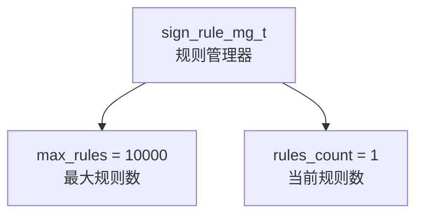
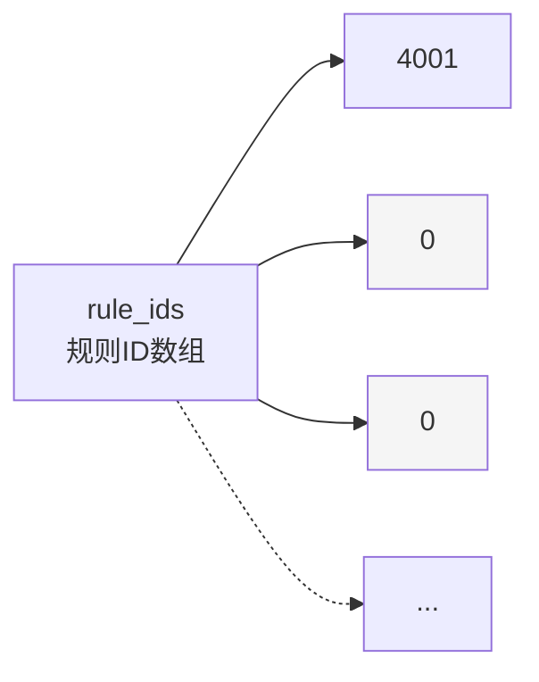

# WAF 规则管理器结构 (rule_mg)

## 基本信息


## 规则ID数组 (rule_ids)


## 规则掩码数组 (rule_masks)
```mermaid
graph TD
    RuleMasks[rule_masks<br>规则掩码数组] --> Mask1[rule_mask_array_t #0]
    Mask1 --> AndMasks1[and_masks[8]<br>条件掩码数组]
    Mask1 --> NotMasks1[not_masks[8]<br>NOT条件掩码数组]
    Mask1 --> SubCount1[sub_rules_count = 1<br>子规则数量]
    
    RuleMasks --> Mask2[rule_mask_array_t #1]
    RuleMasks --> Mask3[rule_mask_array_t #2]
    RuleMasks -.-> Maskn[...]
    
    style Mask2 fill:#f5f5f5
    style Mask3 fill:#f5f5f5
    style Maskn fill:#f5f5f5
```

## 字符串匹配上下文数组 (string_match_context_array)
```mermaid
graph TD
    ContextArray[string_match_context_array<br>上下文数组] --> Context1[string_match_context_t #0]
    
    Context1 --> ProtoName1[proto_var_name<br>"http.uri"]
    Context1 --> PatternsList1[string_patterns_list<br>模式列表]
    Context1 --> PatternsNum1[string_patterns_num = 2<br>模式数量]
    Context1 --> StringIDs1[string_ids<br>模式ID数组]
    Context1 --> HsDB1[db<br>Hyperscan数据库]
    
    PatternsList1 --> Pattern1["Pattern #0<br>{pattern: 'admin'}"]
    PatternsList1 --> Pattern2["Pattern #1<br>{pattern: 'php'}"]
    
    StringIDs1 --> ID1[0]
    StringIDs1 --> ID2[1]
    
    ContextArray --> Context2[string_match_context_t #1]
    ContextArray --> Context3[string_match_context_t #2]
    ContextArray -.-> Contextn[...]
    
    style Context2 fill:#f5f5f5
    style Context3 fill:#f5f5f5
    style Contextn fill:#f5f5f5
```

## 示例规则
```
rule 4001 http.uri contains "admin" and http.uri contains "php";
```

### 内存分配过程
1. 分配主结构体
   ```c
   rule_mg = calloc(1, sizeof(sign_rule_mg_t));
   ```

2. 分配规则ID数组
   ```c
   rule_mg->rule_ids = calloc(max_rules, sizeof(uint32_t));
   ```

3. 分配规则掩码数组
   ```c
   rule_mg->rule_masks = calloc(max_rules, sizeof(rule_mask_array_t));
   ```

4. 分配字符串匹配上下文数组
   ```c
   rule_mg->string_match_context_array = calloc(max_rules, sizeof(string_match_context_t *));
   ```

```
rule_mg
├── max_rules = 10000
├── rules_count = 1
├── rule_ids[0] = 4001
├── rule_masks[0]
│   ├── and_masks[0] = (包含 "admin" 和 "php" 的掩码)
│   ├── not_masks[0] = 0
│   └── sub_rules_count = 1
└── string_match_context_array[0]
    ├── proto_var_name = "http.uri"
    ├── string_patterns_list
    │   ├── [0] = { string_pattern: "admin", ... }
    │   └── [1] = { string_pattern: "php", ... }
    ├── string_patterns_num = 2
    ├── string_ids = [0, 1]
    └── db = (编译后的 Hyperscan 数据库)
```

### 关键字段说明
- **max_rules**: 支持的最大规则数 (10000)
- **rules_count**: 当前已添加的规则数
- **rule_ids**: 存储规则ID的数组
- **rule_masks**: 存储规则条件掩码的数组
- **string_match_context_array**: 存储每个规则的匹配上下文

### 注意事项
- 使用 `calloc` 确保所有内存初始化为 0
- 所有数组大小都基于 `max_rules`
- 灰色框表示未使用的数组槽位